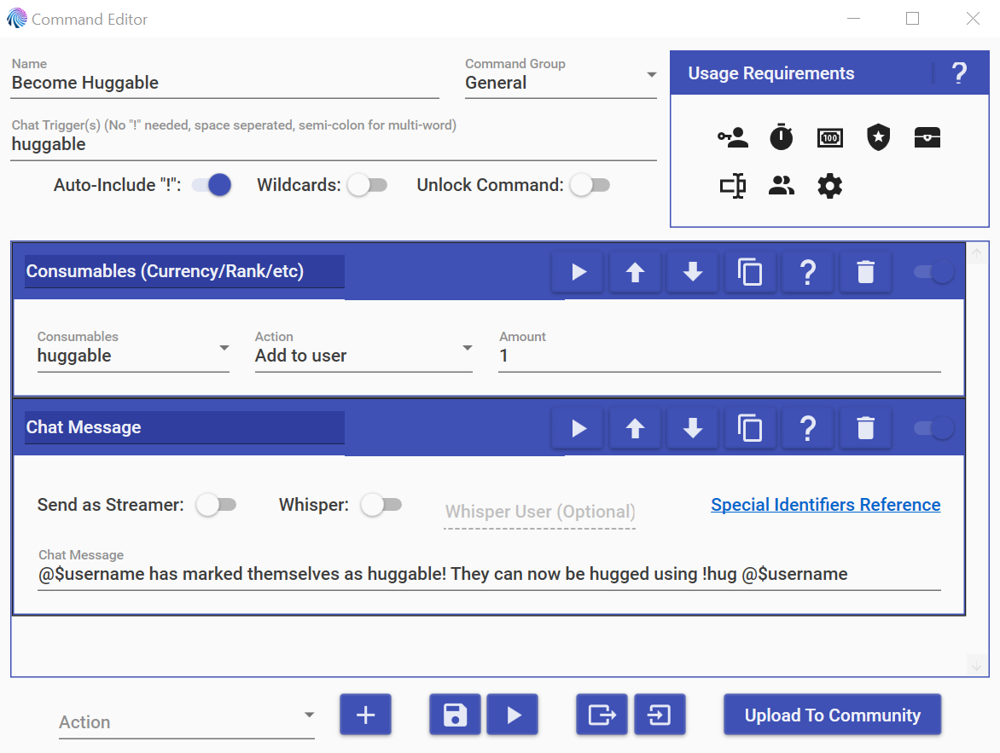
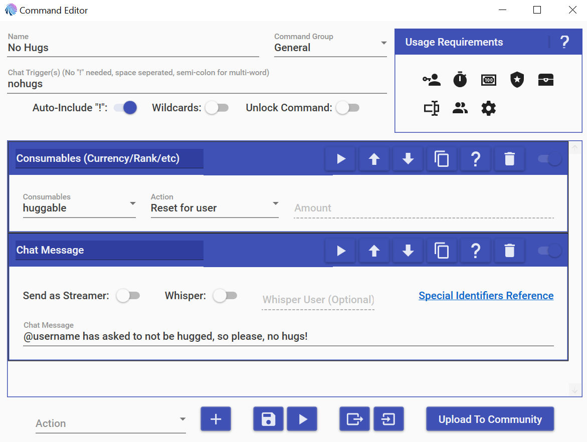
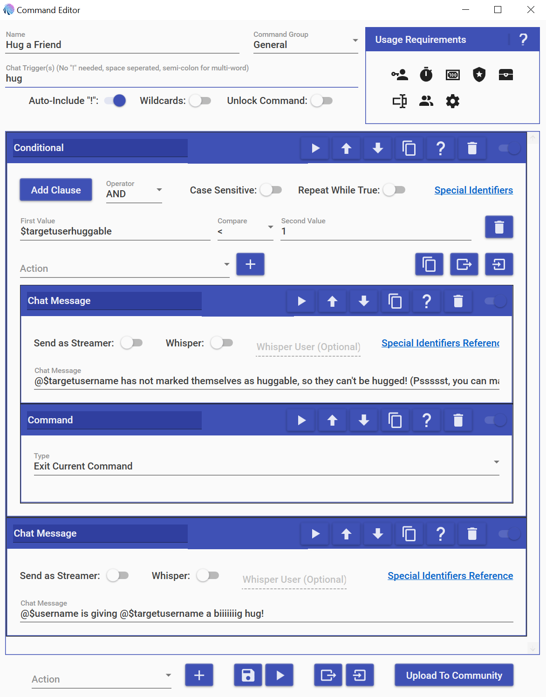

# An Opt-In Hug Command

Hugging can be super common in chats, but not everyone is comfortable with or
wants to be hugged, so I’ve put together this set of commands to let people
opt-in to hugs if they want them.

The way this works is that I have created a special currency that I named
huggable in MixItUp:

<!-- more -->

This currency has a max amount of 1 just so that keeping up with it is a bit easier for me. It is important to set the Online Rate to disabled because we do not want anyone to accidentally be marked as huggable.

When you hit the save button the first time, MixItUp will ask you if you want it to automatically create commands for it. Since this is a special currency that will function differently from most others, I recommend saying “No”.

## The Commands

There are three commands that we need to have this working: !huggable,!nohugs,
and !hug <username>. !huggable is the command that we will use to let a person
agree to receiving hugs. It will give the person 1 huggable, which we can check
for when someone uses the !hug command. My !huggable command looks like this:

The first thing this command does is to give the user who used the command 1
huggable. It then sends a chat message to let people know that this person wants
to be hugged.

Next, we want someone who said they were okay with hugs to be able to turn that
off, which is where the !nohugs command comes in! This resets the person’s
huggable inventory to 0 and sends a chat message to ask everyone to avoid hugging
them. My command looks like this:

The third and final command is a tiny bit more complicated because we have to
check if the person being hugged wants to be hugged. My !hug command looks like
this:

The first part of this command checks to see if the person being hugged wants to
be hugged. $targetuserhuggable will be 1 if the person wants to be hugged and 0
if they do not want to be hugged. I have the condition for this set to
$targetuserhuggable < 1, mainly because I want to avoid someone somehow having a
negative huggable amount (which I don’t think is actually possible) being hugged.

If a person does not wish to be hugged, I send a chat message letting the person
who tried to hug them know that they do not want to be hugged. The full text of
this chat message in my command is “@$targetusername has not marked themselves
as huggable, so they can’t be hugged! (Pssssst, you can mark yourself huggable
using the !huggable command)”. I may remove the reminder about the !huggable
command later because I don’t want this message to feel like it is pressuring
anyone to be huggable.

After we send the chat message, I use the Command action to “Exit Current Command”
which just means that MixItUp will stop there and not continue. This makes it so
that I do not need another Conditional Action. If a person is not accepting hugs,
the command ends here and does not proceed to the last chat message.

And finally, outside of the Conditional action, I have a chat message action.
This is where the person gets hugged if they want to be. The chat message here
is pretty simple, so feel free to change the text to whatever makes sense for
you!
