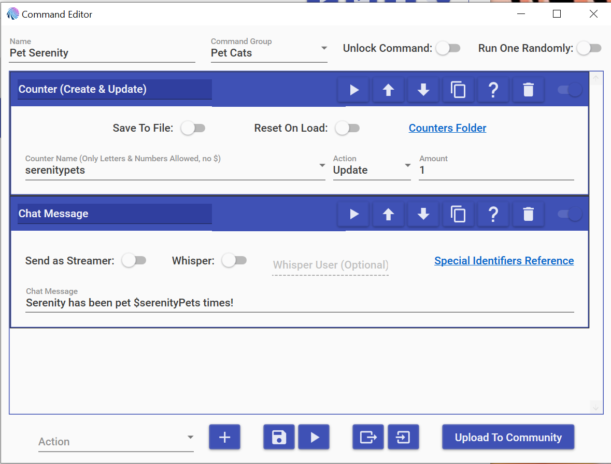
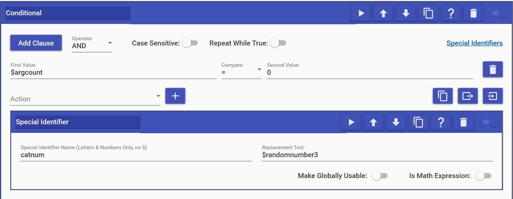
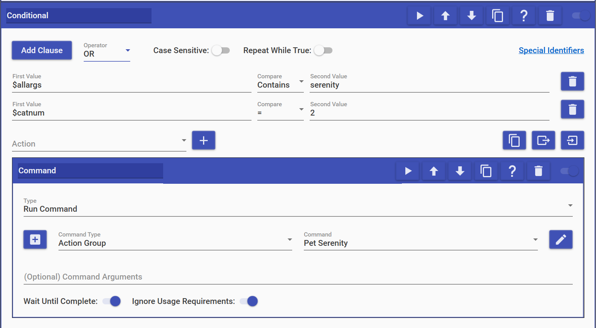

# MixItUp Multi-Pet Command

So, we have 3 cats as of the time I’m writing this post, and I wanted to have a
!pet command that could pet them all at once or individually. This seems to be
different to how many !pet commands are set up because it can accept 0-n
arguments (where n is the number of pets to choose from).

I will break this guide up into a two main parts: Action Groups and the Command.

## Action Groups

I have one Action Group for each pet that the Command will use. I chose to use
Action Groups now because it gives me the ability to re-use the individual pet
actions anywhere else I may want them, but I originally created them because my
first draft of this command was repeating the pet actions in multiple places,
which can be a hassle to update each time. I have since simplified this, but
feel free to put this logic into the Command itself. The process will be the same
either way.

<!-- more -->

These Action Groups have two main steps: update the counter and send a message to
chat. I have a counter for each of our cats: $felixPets, $roryPets, and
$SerenityPets to keep track of how many times each of them has been pet, but this
is optional if you do not wish to keep track. As for the chat message, it can be
anything you like. I’ve gone with something simple, which can be seen in this
screenshot:

I’ve put this Action Group inside a Pet Cats Command Group, but that is more for
keeping MixItUp organized than it is for function. Again, you will need to create
one of these for each pet.

## The Command

This is the most complicated part because there is a lot going on. We need to be
able to check for the names of the cats and generate a random number if no names
are included.

### Checking for Cat Names

For the first section, we need to check to see if any of the cats’ names have
been added as arguments to the command. I do this using a Conditional action.
MixItUp has a helpful Special Identifier we can use here called $argcount.
$argcount will be 0 if someone only types !pet, so this Conditional looks
something like this:

If there are not any arguments ($argcount == 0), then what I do is generate a
random number between 1 and 3 and store it in a Special Identifier named $catnum,
which we will use very soon. This doesn’t need to be globally usable and is not
a math expression, so leave those options off. If you make this Special
Identifier globally usable, the last value will be stored, so the next time the
command is run, a cat might get an extra pet! The horror!

### Petting the Kitties

So, now that we have a random number, we have to assign meanings to the options.
In my case, 1 = Felix, 2 = Serenity, and 3 = Rory. So, for example, if our random
number is 2, Serenity gets pet.

You will need a Conditional Action for each of your pets, and to avoid having 2
or more Conditionals for each pet, these will be slightly more complicated. We
need to check to see if the user entered the correct cat name and also check if
$catnum has rolled the correct number for this cat. Serenity’s Conditional looks
like this:

It is very important that you set the Operator (the dropdown next to the Add
Clause button) to OR because we want this to work if either someone has included
the pet’s name or if their number was rolled. If you do not change this, then no
cat will bet pet at all! For the first value, we need to check for the pet’s name.
`$allargs` is useful for this because we can check if it contains the pet’s name
very easily. The second value to check is our $catnum random number. Since we
chose the OR operator, if either of these things is true, then we will pet
Serenity.

If you have created an Action Group for each of your pets, the Action part of
this should be pretty easy. It needs to call a Command. Set the Command Type to
Action Group and select the correct command. Since this is the Conditional for
Serenity, the command I’ve chosen is the Pet Serenity one.

Remember to create one of these Conditional Actions for each of your pets. They
should be nearly identical except for the pet’s name and the number we’re looking for.

And with that, you should be good to go! Make sure to test this command both with
names included and without. Since the Conditionals for each pet are the most
complicated part, if you run into issues, it’s best to check there first.
