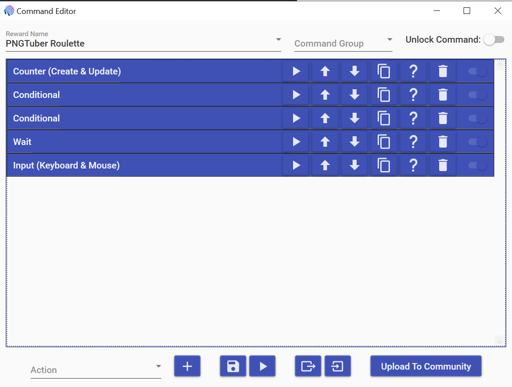
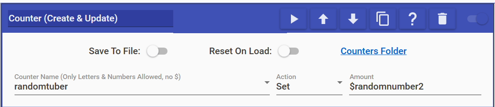
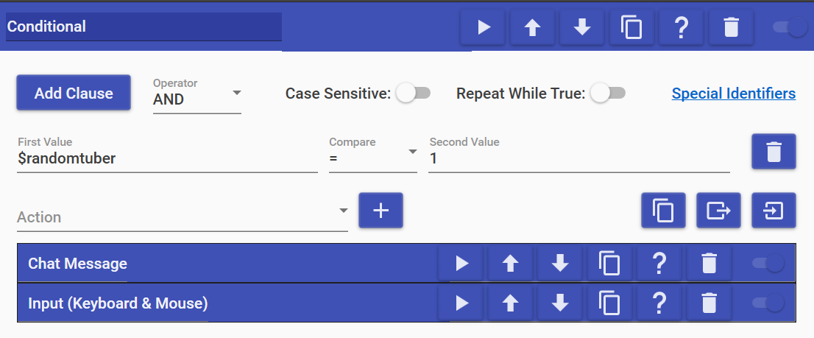
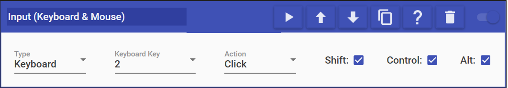

!!! note
    These instructions are for an early version of the PNGTuber Roulette used in
    [PerhapsSam](https://twitch.tv/perhapssam)'s streams. I will put together a
    newer tutorial once I have worked out this issues with it. The new version
    uses MixItUp's timer widgets, which will allow showing countowns of time
    left for each PNGTuber.

I was asked to set up a roulette to choose a random PNGTuber as a Twitch channel
point redeem. After watching a couple YouTube tutorials on how to change a
PNGTuber with MixItUp, I came up with something that works fairly well.

The process here can be broken down into five basic steps: set a hotkey in your
PNGTuber application, generate a random number, use that number to select a
PNGTuber, wait for a set amount of time, and revert back to the default avatar.

So first, we need a hotkey, and we need this because we will tell MixItUp to
press this hotkey, which will change our PNGTuber to the one that was randomly
selected. You will need one for your default avatar and one for each of the
available options.

I generally use veadotube mini, and a hotkey can be chosen by selecting the
PNGTuber you want and hitting the set hotkey button on the top right (it looks
like a keyboard key for the letter H).

Once you have set all your hotkeys up, next you’ll need to hop over to MixItUp
to set up the Twitch channel point command. The way I have done this, I need a
Conditional Action for each available PNGTuber, so for two options, the command
looks something like this:

I’ve used a counter to store the random number, but a Special Identifier action
will also work here. MixItUp provides a helpful random number generator through
its pre-existing Special Identifiers that looks something like this:
`$randomnumber2`. You can replace 2 with the number of roulette options that you
have, but this is what my Counter action looks like:

As you can see, I have named my counter randomtuber, and it can be accessed using
$randomtuber wherever else you may need it.

The next step is to set up a Conditional Action for each of your PNGTuber
options. Like previously mentioned, I have two to choose from, but you may have
more as needed. Now, the random number generator will generate a number between
1 and whatever number you have at the end, so the possible numbers for me are 1
and 2, so my first Conditional Action looks like this:

I’ve set a unique chat message for each of the PNGTuber options as a sort of
announcement, but that step is entirely optional. The important action connected
to this Conditional Action is the Input(Keyboard & Mouse) Action, which I am
using to press one of the hotkeys I set earlier. Since the hotkey for this
particular PNGTuber is Ctrl+Alt+Shift+2, my Input Action looks like this:

Feel free to use whichever key combinations suit you. I don’t use these
combinations for anything else, so they make sense for me, but maybe something
different works better for you.

The next two steps are optional if you do not want to switch back to a default
PNGTuber, but if you have a PNGTuber you normally use and want to make sure that
you turn back into yourself automatically, keep reading!

The next to last step is the Wait Action, which lets you have MixItUp wait a
certain number of seconds before moving on to the next Action. Since this Action
does not have a lot of flexibility, I am not including a screenshot here, but put
the number of seconds you wish to wait before changing back in. I have chosen 900
seconds as that feels like an appropriate amount of time to wait before changing
back, but choose whatever makes sense for you.

Finally, it is time to change back into your default PNGTuber. You can do this by
using one final Input(Keyboard & Mouse) Action that presses the hotkey you
selected earlier for your default PNGTuber. In my case, that hotkey is
Ctrl+Alt+Shift+1, so my action looks like this:

You can test this all by setting your wait time to something short like 5 seconds
and running the command using the play button at the bottom of the Command Editor.
Once you are satisfied that it is working, save the command, and you’re good to go!
