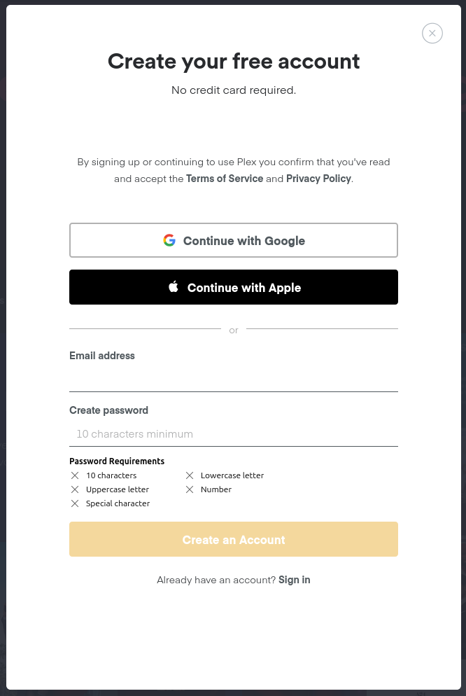

# Plex Account Setup

Plex is an online media streaming service that lets users set up a server
to host their own media. This means that you can rip your CD's, DVD's,
Blu-Rays, etc. and stream them at home or really wherever you have an
internet connection. Even if you don't personally want to host a Plex
server, though, one of your friends might, and there's also often things
to stream and rent available.

Setting up an account on Plex is free and pretty easy. Go to the
[Plex website](https://www.plex.tv/), and click on the "Sign Up Free"
button. The registration form should look something like this:

Once you have created an account, you can browse the various things
that are available for free in your [browser](https://app.plex.tv)
or on the Plex app that is available on most smart TVs and phones.

The browser version of Plex looks like this:

## Friends

If you have a friend who hosts a Plex server, they can send you an
invitation to watch what they have available. Generally, they will
need the email address you used to register your Plex account or the
username you chose.

Once you have accepted an invitation, you will have access to their
library.
